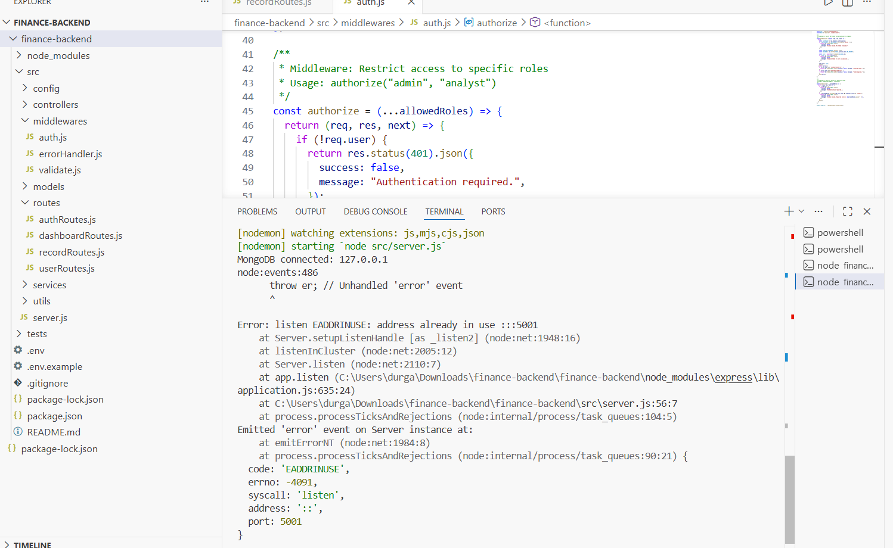
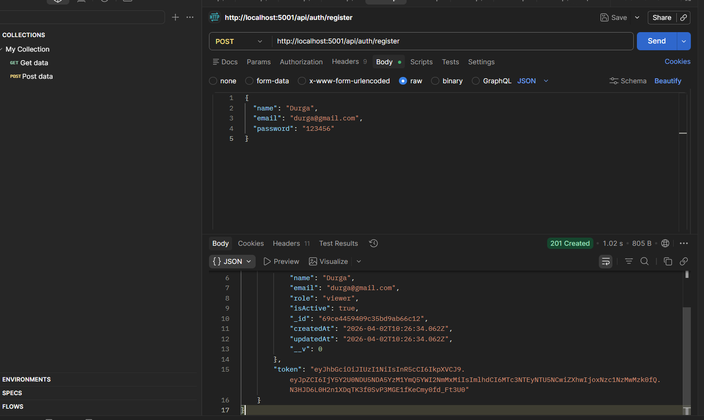
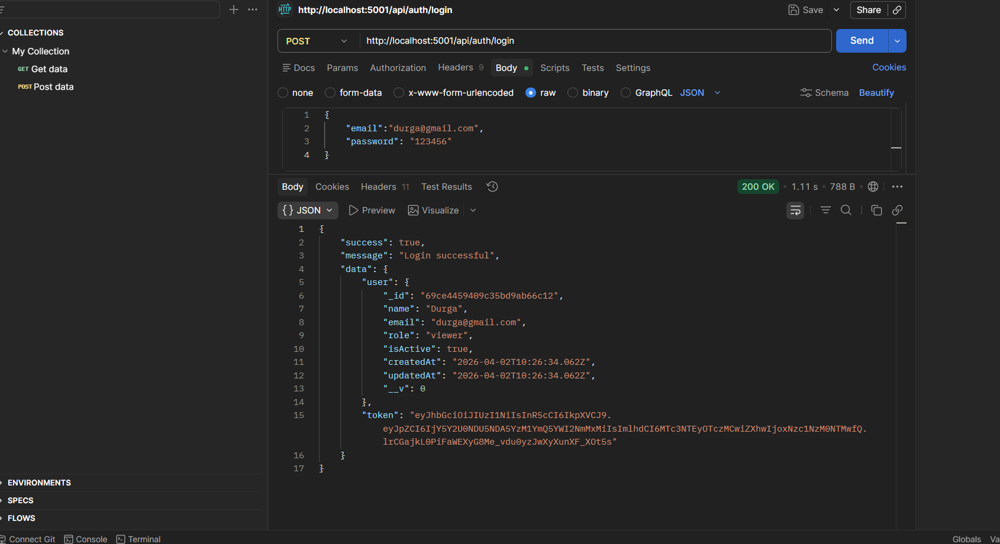
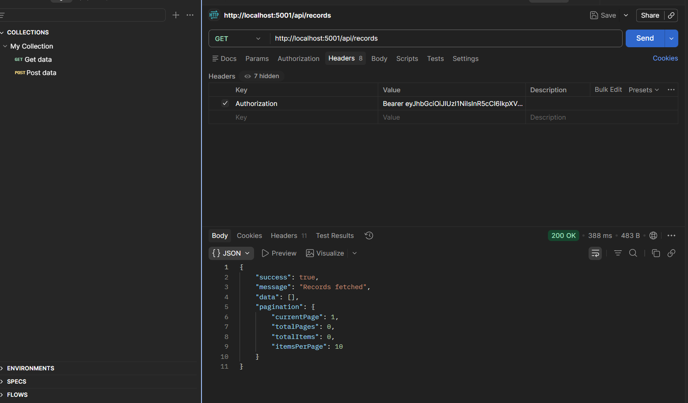
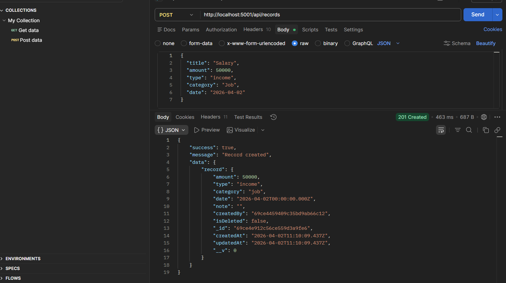
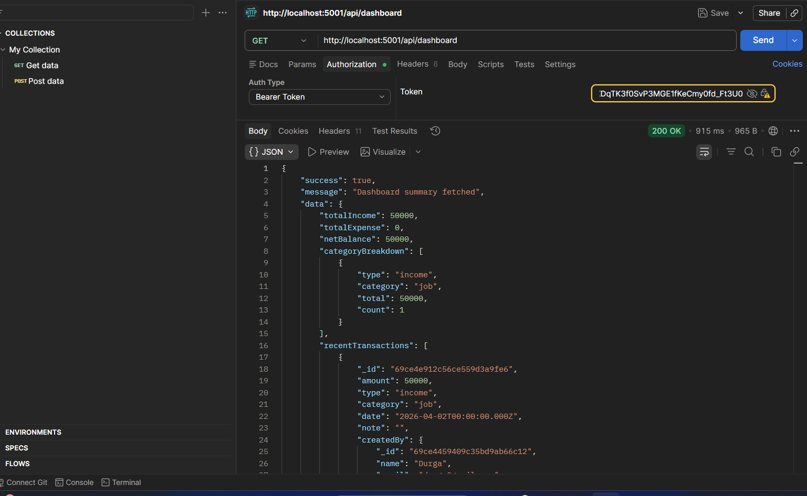

# Finance Dashboard Backend

## 🚀 Features
- 🔐 Secure Authentication (JWT-based login system)
- 👥 Role-Based Access Control (Admin/User roles)
- 💰 Finance Record Management (CRUD operations)
- 📊 Dashboard with aggregated financial insights
A RESTful backend API for a Finance Dashboard application with role-based access control, built with **Node.js**, **Express**, and **MongoDB**.

## Architecture

```
src/
├── config/          # Database connection & constants
├── controllers/     # Request handlers (thin layer)
├── middlewares/      # Auth, validation, error handling
├── models/          # Mongoose schemas
├── routes/          # Route definitions with validation
├── services/        # Business logic layer
├── utils/           # Helpers (API response, token generation)
└── server.js        # App entry point
```

**Design Decisions:**
- **Service layer pattern** — controllers are thin; business logic lives in services for testability
- **Soft delete** — records use `isDeleted` flag instead of permanent deletion
- **Standardized responses** — all endpoints return `{ success, message, data }` format
- **Input validation** — express-validator on routes + Mongoose schema validation

## Setup

```bash
# 1. Install dependencies
npm install

# 2. Create .env file (see .env.example)
cp .env.example .env

# 3. Start MongoDB (ensure it's running locally or update MONGODB_URI)

# 4. Run the server
npm run dev     # Development with auto-reload
npm start       # Production
```

## API Endpoints

### Authentication
| Method | Endpoint            | Access  | Description           |
|--------|--------------------|---------|-----------------------|
| POST   | /api/auth/register | Public  | Register a new user   |
| POST   | /api/auth/login    | Public  | Login & get JWT token |
| GET    | /api/auth/me       | Private | Get current user      |

### User Management (Admin only)
| Method | Endpoint               | Description            |
|--------|------------------------|------------------------|
| GET    | /api/users             | List all users         |
| GET    | /api/users/:id         | Get user by ID         |
| PATCH  | /api/users/:id/role    | Update user role       |
| PATCH  | /api/users/:id/status  | Toggle active/inactive |

### Financial Records
| Method | Endpoint          | Access       | Description         |
|--------|-------------------|-------------|---------------------|
| GET    | /api/records      | All roles   | List records (filtered, paginated) |
| GET    | /api/records/:id  | All roles   | Get single record   |
| POST   | /api/records      | Admin       | Create record       |
| PUT    | /api/records/:id  | Admin       | Update record       |
| DELETE | /api/records/:id  | Admin       | Soft delete record  |

**Query Parameters for GET /api/records:**
- `type` — filter by `income` or `expense`
- `category` — filter by category name
- `startDate` / `endDate` — date range (ISO 8601)
- `page` / `limit` — pagination (default: page=1, limit=10)
- `sort` — sort field (default: `-date`)

### Dashboard (Analyst & Admin)
| Method | Endpoint                  | Description                |
|--------|--------------------------|----------------------------|
| GET    | /api/dashboard           | Full summary               |
| GET    | /api/dashboard/categories| Category-wise breakdown    |
| GET    | /api/dashboard/trends    | Monthly trends (12 months) |

### Health Check
| Method | Endpoint      | Description    |
|--------|--------------|----------------|
| GET    | /api/health  | Server status  |

## Role Permissions

| Action                | Viewer | Analyst | Admin |
|-----------------------|--------|---------|-------|
| View records          | ✅     | ✅      | ✅    |
| View dashboard        | ❌     | ✅      | ✅    |
| Create/edit records   | ❌     | ❌      | ✅    |
| Delete records        | ❌     | ❌      | ✅    |
| Manage users          | ❌     | ❌      | ✅    |

## Example Requests

### Register
```bash
curl -X POST http://localhost:5000/api/auth/register \
  -H "Content-Type: application/json" \
  -d '{"name":"John","email":"john@example.com","password":"pass123","role":"admin"}'
```

### Create Record
```bash
curl -X POST http://localhost:5000/api/records \
  -H "Content-Type: application/json" \
  -H "Authorization: Bearer <token>" \
  -d '{"amount":5000,"type":"income","category":"salary","date":"2024-03-15","note":"March salary"}'
```

### Get Dashboard
```bash
curl http://localhost:5000/api/dashboard \
  -H "Authorization: Bearer <token>"
```

## Features
- ✅ JWT authentication
- ✅ Role-based access control (Viewer / Analyst / Admin)
- ✅ CRUD for financial records
- ✅ Dashboard analytics with aggregation pipelines
- ✅ Input validation (express-validator + Mongoose)
- ✅ Soft delete
- ✅ Pagination
- ✅ Rate limiting
- ✅ Standardized API responses
- ✅ Global error handling

## Assumptions
- Users can self-register with any role (in production, admin role assignment would be restricted)
- All financial records are shared across the system (not user-scoped) since it's a company dashboard
- Soft delete is used to preserve audit trail
- MongoDB is used as the primary database for flexibility with aggregation queries

## Screenshots

### Server Running


### Register API


### Login API


### Get Records


### Create Record


### Dashboard

